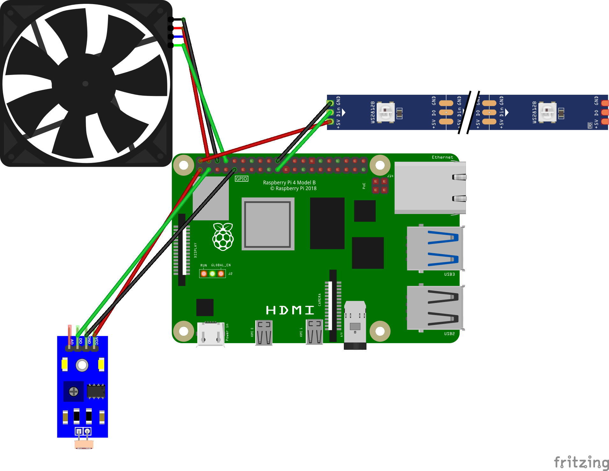

# Table of Contents

## Overview

This is The Cat Doorbell (version 2.0). I had lots of fun designing and building it. I am writing this in case
someone else might find it useful. For example, this could easily be adapted for dogs.

## The Problem(s)

We have a cat that likes to go out on our enclosed patio. When he is ready to come in, he will stand next to the door
and meow (yell). We open the door and let him in. No problem.

But, he frequently stays out long enough for us to forget. More than once he was outside yelling and we were oblivious.
That's problem #1.

It is also complicated by the fact that he likes to yell anyway. He will lay on the ground wallowing and yelling just
for the fun of it. That causes "false alarms". We would think he wants in, but all he was really doing is enjoying
life. Frustrating to us (but I think it secretly amuses the cat). That's problem #2.

Somehow, we needed a device that would:

- Alert us when the cat wanted inside (fix Problem #1)
- Ensure that was **really** his intention (fix Problem #2)

Clearly, we needed at Cat Doorbell.

## Basic Logic

The Doorbell will send me a text alert when the cat wants inside. It will only do that if a cat is heard **and** seen.
It is always listening, but the Doorbell doesn't look for a cat until it hears meowing. An LED strip will be lit to
aid the camera if dark outside.

## Logic Detail

This is essentially a small state machine. The Doorbell listens passively for the sound of a cat meowing. When it hears
that sound, it enables a camera. If the on-board light sensor detects darkness, an LED strip will be turned on. For 45
seconds the Doorbell uses the camera in an attempt to identify a cat. If no cat is identified, the Doorbell goes back
to passively listening. If dark, the light is then turned off. If a cat is identified during the 45-second window,
a text message is sent to me. The system then pauses for 2 minutes for to prevent triggering a new alarm. If dark,
the LED light stays on until after the 2-minute pause is over. The Doorbell then goes back to listening.

## Machine Learning Detail

The the code in `doorbell.py` is basically a combination of 2 [Tensorflow](https://www.tensorflow.org/) sample
applications. [One](https://github.com/tensorflow/examples/blob/master/lite/examples/audio_classification/raspberry_pi/classify.py)
application identifies an "object" by sound, and the [other](https://github.com/tensorflow/examples/blob/master/lite/examples/image_classification/raspberry_pi/classify.py)
by sight.

## Text Messaging

I am a longtime Amazon Web Services (AWS) user. I used their facilities to generate SMS text messages in `doorbell.py`.
I use`requests.post()` to initiate the message.

Briefly, here is how it works on AWS. It is a POST message to a REST API URL. The REST definition is an API Gateway on
AWS. The API Gateway passes the POST information to an AWS Lambda function (see `aws-lambda/cat-doorbell-lambda.py`
in this repo for the source). The Lambda invokes a call to a Simple Notification Service (SNS) topic. That topic is
associated with a particular phone number. A message from the Lambda function is sent to that phone number. Make sense?

Do not panic if that does not make sense. AWS is **not** a trivial subject. I use AWS because I'm used to it. You
don't have to.

There is an alternative. Look at [pushover](https://pushover.net/). They support REST APIs (with samples) and
they are inexpensive. You can send your messages using their API. Simply use their REST URL in my `requests.post()`
invocation and you should be fine.

## Geeky Hardware Details

Here are some in-depth discussions of the Doorbell hardware setup. See the parts list and pictures below for all the
components I covered.

### The Raspberry Pi
The heart of the Doorbell is a Raspberry Pi 4B. It sits in a weatherproof junction box next to our patio door. The only
physical connection is a power cable run from inside the house.

### Junction Box Door
The junction box has a clear plexiglass door so the camera can "see". There are also 4 tiny holes drilled into the
underside of the door. These allow the microphone to "hear".

### Wi-Fi

The Doorbell RPi has Wi-Fi enabled. It is connected to our home network.

### Temperature Precautions

Although the Doorbell is never in direct sunlight, I took some precautions for the Summer heat (we live in Tennessee).
Attached to the RPi motherboard is a special heatsink/fan combination to help regulate temperature. It uses physical
pins #4 (power), #6 (ground) and #8 (GPIO #14). Fan control has been enabled via `raspi-config`.

### Light Sensor
Next to the RPi inside the junction box, is the light sensor. Technically, it is a photo resistor, but I'll refer to it
as "light sensor"). It is connected to physical pins #1 (for 3.3v power), #3 (GPIO #2), and #9 (ground). The light
sensor is encased in a tiny project box with holes dremeled in it to allow for connections and sensor exposure. The
small box containing the sensor is secured to the inside of the main junction box by strips of magnetic tape
(see pics below).

### USB Camera and Microphone
We use USB for our camera and microphone. Space is tight, so the USB connection is via a right-angle adapter. Here we
connect a little board that is a combination camera/microphone. The board is mounted on the lid of a little project box.
The project box fits the width of the junction box exactly. The camera/mic board is secured to the lid with 3 nylon
screws. Coiled inside the project box is the excess USB cable. On the sides of the little box are small dremeled
apertures for cable access.

### LED Strip
Also mounted on the project box I just mentioned is an LED light strip. The strip itself is encased in a small strip of
aluminum trough which is secured to the project box lid with a couple Nylon screws and bolts. The actual LED strip
itself is secured inside the trough with double-sided tape. Snapped on top of the aluminum trough is a light diffuser
(opaque plastic strip). The LED strip is attached to the RPi via 3-pin modular connector. The modular connector is
attached to another modular connector which is directly attached to pins on the RPi. The physical pin used to control
the LED strip #19 (GPIO 10). The strip is powered by physical pin #2 (5V power). Physical pin #14 (ground) is attached
to LED strip's ground connector.

### Power Cable

Like I mentioned before, the only physical outside connection to the RPi is power. There are a few things
to mention concerning it. To begin with, inside the house, the cable is attached to the actual power supply using a
USB-C female adapter. The adapter is attached to the cable with wire joiners. At the Doorbell end, the cable enters
the junction box through a weatherproof cable "glad" (icky name). Inside the junction box wire joiners are used to
connect to a male USB-C adapter. Due to space constraints, the RPi USB-C connection goes via a right-angle adapter.

## Wiring Diagram

## Parts List

1. [RPi 4b](https://www.amazon.com/Raspberry-Pi-Computer-Suitable-Workstation/dp/B0899VXM8F/ref=sr_1_6?crid=3M53AFTGRSLTU&keywords=raspberry+pi+4&qid=1696697746&sprefix=raspberry+pi+4+%2Caps%2C122&sr=8-6&ufe=app_do%3Aamzn1.fos.18ed3cb5-28d5-4975-8bc7-93deae8f9840)
2. [RPi Heat Sink and Fan Adapter](https://www.amazon.com/gp/product/B091L1XKL6/ref=ppx_yo_dt_b_search_asin_title?ie=UTF8&psc=1)
3. [Junction Box](https://www.amazon.com/gp/product/B0BZR4VPRF/ref=ppx_yo_dt_b_search_asin_title?ie=UTF8&th=1)
4. [Project Box](https://www.amazon.com/gp/product/B07Q14K8YT/ref=ppx_yo_dt_b_search_asin_title?ie=UTF8&th=1)
5. [Dremel Tool](https://www.amazon.com/Dremel-7350-5-3-6v-Rotary-Tool/dp/B08YKH9JRH/ref=sr_1_9?crid=294P32W1GG817&keywords=dremel%2Btool%2Bkit&qid=1696687687&sprefix=dremel%2Caps%2C147&sr=8-9&th=1)
6. [Dremel Bits](https://www.amazon.com/Mars-Rock-Carbide-Compatible-Accessories-Attachments/dp/B0B5TWSRCV/ref=sr_1_10?crid=294P32W1GG817&keywords=dremel%2Btool%2Bkit&qid=1696687809&sprefix=dremel%2Caps%2C147&sr=8-10&th=1)
7. [Breadboard Jumper Wires](https://www.amazon.com/Breadboard-Compatible-Arduino-Projects-Raspberry/dp/B0BTT31CBC/ref=sr_1_1_sspa?crid=3C472YJ0GXP2P&keywords=breadboard%2Bjumper%2Bwires&qid=1696697823&sprefix=breadboard%2Bj%2Caps%2C122&sr=8-1-spons&sp_csd=d2lkZ2V0TmFtZT1zcF9hdGY&th=1)
8. [Wire Joiners](https://www.amazon.com/gp/aw/d/B089D79CPF/?_encoding=UTF8&pd_rd_plhdr=t&aaxitk=040da90ea460846b0b1ae8971d4b2b75&hsa_cr_id=2900520900001&qid=1696697866&sr=1-3-9e67e56a-6f64-441f-a281-df67fc737124&ref_=sbx_be_s_sparkle_lsi4d_asin_2_title&pd_rd_w=2xrRf&content-id=amzn1.sym.cd95889f-432f-43a7-8ec8-833616493f4a%3Aamzn1.sym.cd95889f-432f-43a7-8ec8-833616493f4a&pf_rd_p=cd95889f-432f-43a7-8ec8-833616493f4a&pf_rd_r=AC000Z7G7200YE2AT2MW&pd_rd_wg=GSU3T&pd_rd_r=6632e09c-baca-43bc-83b5-cbe161e6444a&th=1)
9. [Wire Stripper](https://www.amazon.com/gp/product/B0953113F7/ref=ppx_yo_dt_b_search_asin_title?ie=UTF8&psc=1)
10. [Mini Screwdriver Kit](https://www.amazon.com/gp/product/B07YJG766F/ref=ppx_yo_dt_b_search_asin_title?ie=UTF8&psc=1)
11. [Drill](https://www.amazon.com/DECKER-LD120VA-20-Volt-Lithium-Accessories/dp/B006V6YAPI/ref=sr_1_4?crid=3MXHHV7Q0GQTQ&keywords=drill&qid=1696704901&s=hi&sprefix=drill%2Ctools%2C124&sr=1-4)
12. [2-Conductor Cable](https://www.amazon.com/gp/product/B0BV4391Z2/ref=ppx_yo_dt_b_search_asin_title?ie=UTF8&th=1)
13. [Drill Bits](https://www.amazon.com/gp/product/B004GIO0F8/ref=ppx_yo_dt_b_search_asin_title?ie=UTF8&th=1)
14. Phillips Head Drill Bit (usually comes with drill)
15. [Microphone/Camera Board](https://www.amazon.com/gp/product/B0CGMZ665J/ref=ppx_yo_dt_b_search_asin_title?ie=UTF8&psc=1)
16. [USB Right Angle Converter](https://www.amazon.com/gp/product/B0BY8ZFGWY/ref=ppx_yo_dt_b_search_asin_title?ie=UTF8&psc=1)
17. [USB-C right Angle Converter](https://www.amazon.com/gp/product/B0BRCNMRVK/ref=ppx_yo_dt_b_search_asin_title?ie=UTF8&psc=1)
18. [LED Strip](https://www.amazon.com/gp/product/B01CDTEID0/ref=ppx_yo_dt_b_search_asin_title?ie=UTF8&th=1)
19. [LED Strip Light Diffuser](https://www.amazon.com/THMOOTHER-Surface-Mounted-Aluminum-Diffuser/dp/B0C6GKXNWQ/ref=sr_1_2_sspa?crid=2R6R6RQDA39XT&keywords=led%2Bstrip%2Blight%2Bdiffuser&qid=1696705199&s=hi&sprefix=led%2Bstrip%2Blight%2Bd%2Ctools%2C124&sr=1-2-spons&sp_csd=d2lkZ2V0TmFtZT1zcF9hdGY&th=1)
20. [Double Sided Adhesive Tape](https://www.amazon.com/LAPANDA-Double-Waterproof-Length-Office/dp/B093T1MF5D/ref=sr_1_3_sspa?crid=3TBGNKCCB8UQI&keywords=3m+double+sided+tape&qid=1696705256&sprefix=3m+double%2Caps%2C119&sr=8-3-spons&sp_csd=d2lkZ2V0TmFtZT1zcF9hdGY&psc=1)
21. [3-Pin LED Connectors](https://www.amazon.com/gp/product/B01DC0KIT2/ref=ppx_yo_dt_b_search_asin_title?ie=UTF8&psc=1)
22. [Cable Gland ](https://www.amazon.com/MAKERELE-Plastic-Waterproof-Adjustable-Protectors/dp/B094ZF2Z3T/ref=sr_1_7?crid=WQWIJ1NE7ITV&keywords=1%2F2%2Binch%2Bcable%2Bgland&qid=1696705395&s=hi&sprefix=1%2F2%2Binch%2Bcable%2Bgland%2Ctools%2C123&sr=1-7&th=1)
23. [Female USB-C to Wire Adapter](https://www.amazon.com/gp/product/B0BFHW7PXD/ref=ppx_yo_dt_b_search_asin_title?ie=UTF8&th=1)
24. [Male USB-C to Wire Adapter](https://www.amazon.com/gp/product/B0BFHXWCS9/ref=ppx_yo_dt_b_search_asin_title?ie=UTF8&psc=1)
25. [RPi 4 USB-C Power Supply](https://www.amazon.com/gp/product/B097P2NLVH/ref=ppx_yo_dt_b_search_asin_title?ie=UTF8&psc=1)
26. [Wiring Clips](https://www.amazon.com/500-Pack-Mounting-Management-Assorted-Connectors/dp/B07J58KFCK/ref=sxin_16_pa_sp_search_thematic_sspa?content-id=amzn1.sym.9b3a7124-32d3-4c74-8dd8-3559a005f3df%3Aamzn1.sym.9b3a7124-32d3-4c74-8dd8-3559a005f3df&crid=9GI66R3H7FRC&cv_ct_cx=wiring+clips&keywords=wiring+clips&pd_rd_i=B07J58KFCK&pd_rd_r=f3819f55-8d27-4b1e-99ef-dc95ffdc2447&pd_rd_w=UtLMB&pd_rd_wg=FTlUf&pf_rd_p=9b3a7124-32d3-4c74-8dd8-3559a005f3df&pf_rd_r=GPRCSZGHKDPDWPZ6S36M&qid=1696705537&sbo=RZvfv%2F%2FHxDF%2BO5021pAnSA%3D%3D&sprefix=wiring+clips%2Caps%2C119&sr=1-2-2c727eeb-987f-452f-86bd-c2978cc9d8b9-spons&sp_csd=d2lkZ2V0TmFtZT1zcF9zZWFyY2hfdGhlbWF0aWM&psc=1)
27. [Nylon Screws and Bolts](https://www.amazon.com/gp/product/B0744MMJ9V/ref=ppx_yo_dt_b_search_asin_title?ie=UTF8&psc=1)
28. [Light Sensor](https://www.amazon.com/gp/product/B0BG56NG5S/ref=ppx_yo_dt_b_search_asin_title?ie=UTF8&psc=1)
29. [Magnetic Tape](https://www.amazon.com/gp/product/B081CZ7V1V/ref=ppx_yo_dt_b_search_asin_title?ie=UTF8&psc=1)
30. [Wood Screws](https://www.amazon.com/Wood-Screws-Stainless-Adjustable-Countersink/dp/B08RDHCM2Q/ref=sr_1_1_sspa?crid=27RU6LMOY4HUR&keywords=wood+screws+1+inch&qid=1696705865&sprefix=wood+screws%2Caps%2C111&sr=8-1-spons&sp_csd=d2lkZ2V0TmFtZT1zcF9hdGY&psc=1)
31. [Tiny Project Box](https://www.amazon.com/gp/product/B07F3Q784X/ref=ppx_yo_dt_b_search_asin_title?ie=UTF8&th=1)
32. [Shrink Tubing](https://www.amazon.com/gp/product/B07WWWPR2X/ref=ppx_yo_dt_b_search_asin_title?ie=UTF8&psc=1)
33. [Soldering Iron](https://www.amazon.com/gp/product/B07RVMZNYR/ref=ppx_yo_dt_b_search_asin_title?ie=UTF8&th=1)
34. Solder/FLux (generally comes w/the soldering iron)

## Pictures 

*The Doorbell mounted next to our patio door*

*The cable-to-male-USB-C-adapter connection inside the house*

*The USB-C adapter connected to the main power supply in the house*

*The Doorbell with the plexiglass door open*

*The small project box lifted out of the Doorbell. Note that both connections to the RPi are modular, so the whole
unit can be disconnected and lifted out of the junction box*

*The LEDs and cam/mic assembly*

*Closeup of LED and cam/mic assembly. Note the nylon screws holding the board in place*

*Closeup of the back of the lid for the project box. On the other side of this lid is the LED and cam/mic board*

*Inside the project box where we coil the excess USB cable. Note the dremeled apertures at the top and bottom to
allow cable access*

*The junction box without the cam/mic/LED assembly in place. Note the right-angle adapters for RPi power and USB*

*The light sensor encased in a tiny project box. The hole on top is to access the sensitivity adjustment. Note the
magnetic tape on top*

*Looking up and to the inside left of the open junction box. Magnetic tape is installed where light sensor's box will
be affixed*

*Closeup of the RPi power connection with the right-angle USB-C adapter*

*Closeup of the power cable entering the junction box through the gland*

